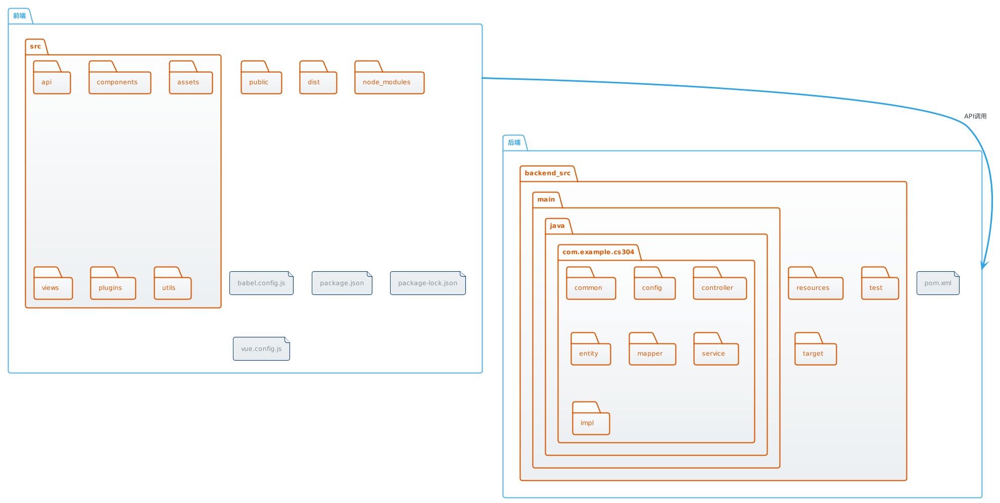
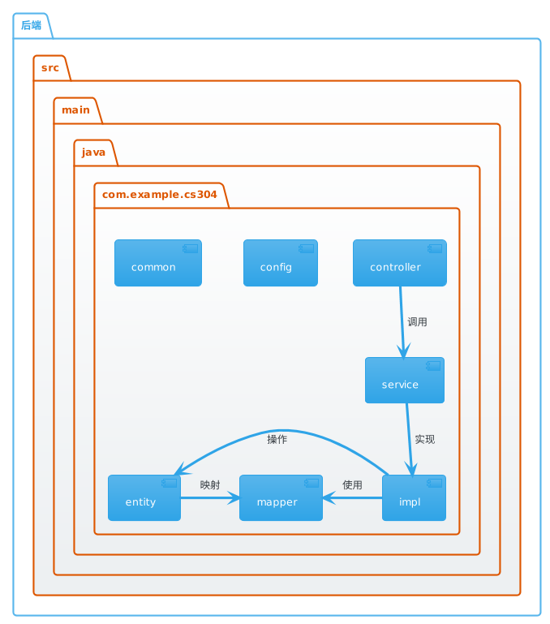
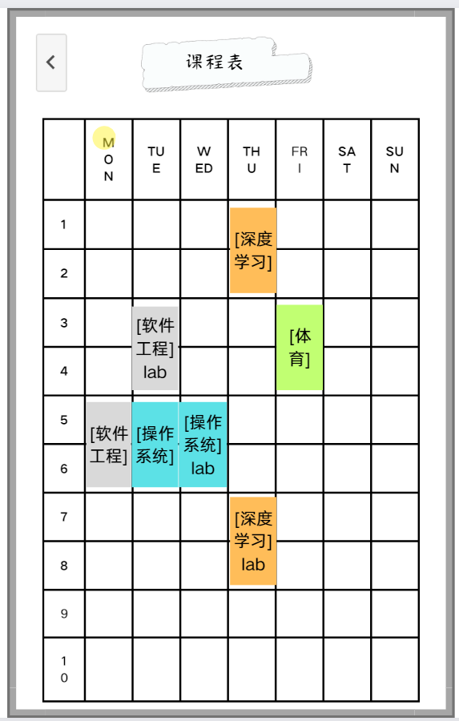
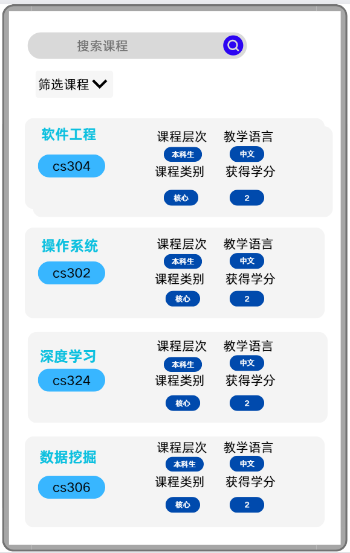
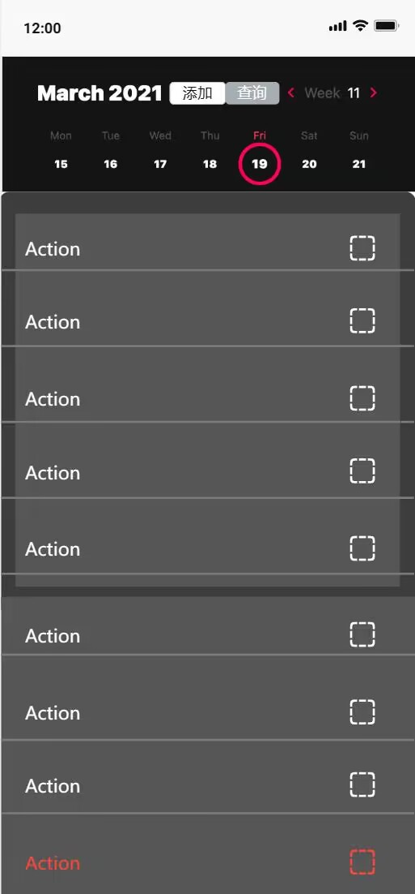
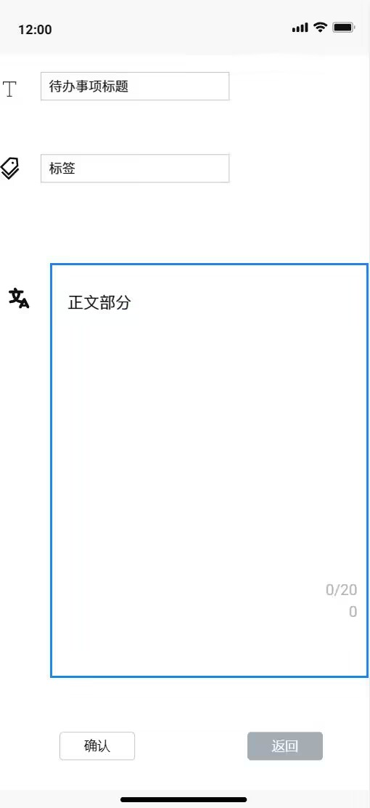
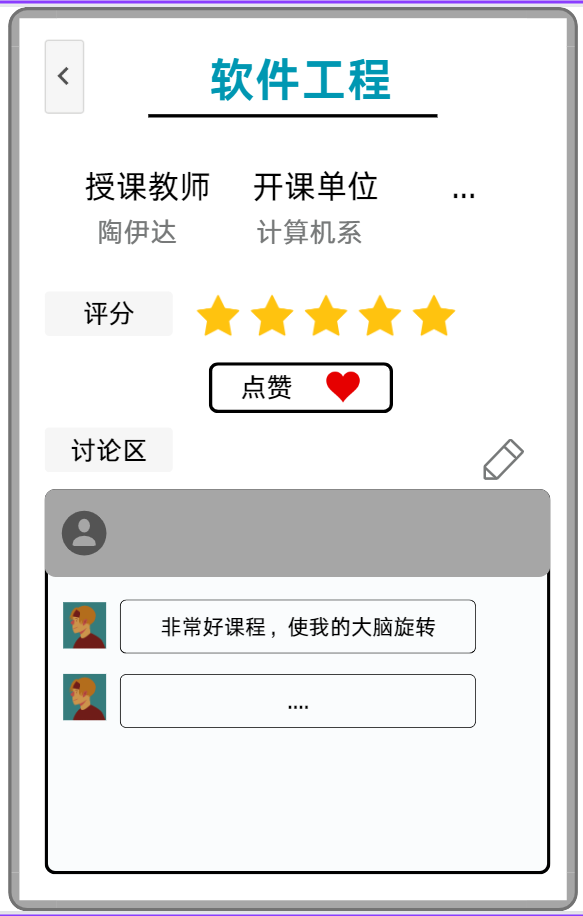
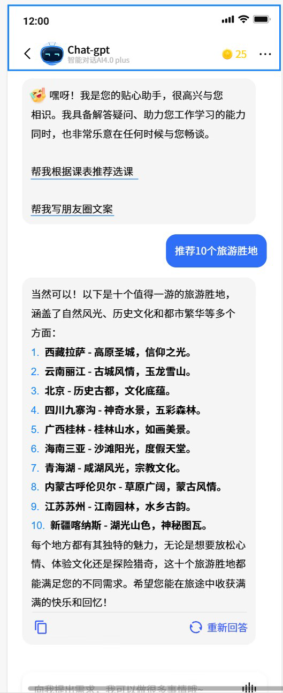
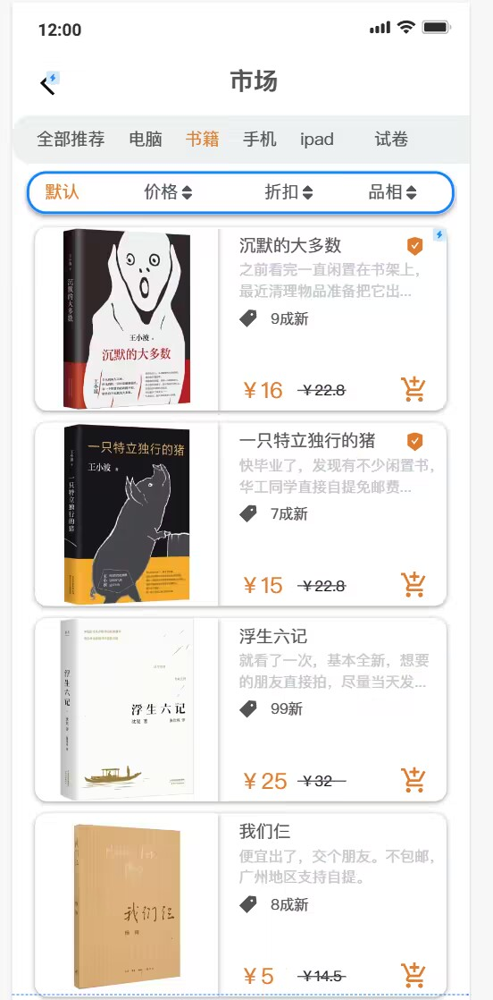
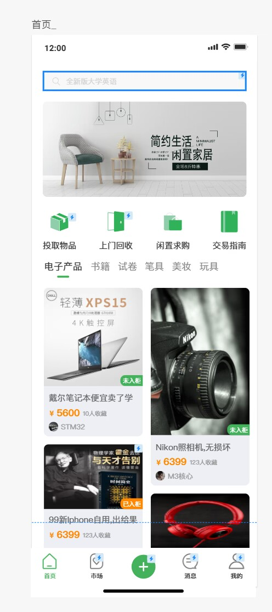

## 1. 架构设计

### 图
前后端架构及交互：

后端架构：

### 自然语言描述
我们使用的是前后端分离的项目架构，前端基于Vue.js框架，后端基于java语言和SpringBoot框架。这种架构通常用于Web开发，以实现更好的可扩展性、可维护性和灵活性。

### 前端：
前端目录包含与应用程序用户界面和客户端逻辑相关的文件。以下是前端目录结构的详细说明：

- **src**: 源代码。
  - **api**: 包含与API通信相关的文件。
  - **components**: 包含可重用的UI组件。
  - **assets**: 存储静态资源，如图像、字体等。
  - **views**: 包含应用程序的视图或页面。
  - **plugins**: 包含任何插件或第三方集成。
  - **utils**: 实用函数或模块。
- **public**: 包含作为原样提供的静态文件。这通常包括HTML文件，它是前端应用程序的入口点。
- **node_modules**: 包含通过npm或yarn安装的依赖关系。
- **babel.config.js**, **package.json**, **package-lock.json**, **README.md**, **vue.config.js**: Vue.js项目的配置文件。

### 后端：
后端目录包含与服务器端逻辑和API实现相关的文件。以下是后端目录结构的详细说明：

- **src**: 源代码。
  - **main**: 主要应用程序逻辑。
    - **java**: Java源文件。
      - **com.example.cs304**: 应用程序的根包。
        - **common**: 包含跨应用程序使用的通用工具或功能。包含 Util 等类。
        - **config**: 配置文件。包含 CacheConfig、MybatisConfig等类。
        - **controller**: API控制器,用于处理Web请求和响应。包含 CourseController、DianZanController 等类。
        - **entity**: 表示数据库表或对象的实体类。包含 Course、dianzan 等类。
        - **mapper**: 数据访问层，对象-关系映射（ORM）映射器，与数据库进行交互。包含 CourseMapper、DianzanMapper 等类。
        - **service**: 业务逻辑或服务类。包含 ICourseService、DianzanService 等类。
        - **impl**: 实现类。包含  ICourseServiceImpl、DianzanServiceImpl 等类。
- **resources**: 包含应用程序属性或配置文件。
- **test**: 包含测试文件。
- **target**: 包含已编译的字节码和构建产物。
- **pom.xml**: Maven配置文件，用于管理依赖关系和构建后端应用程序。

### 交互：
前端通过API调用与后端进行交互。后端公开API，供前端使用以检索和操作数据。这种分离允许独立开发，并且容易维护前端和后端组件。

<!-- AI-generated-content -->
<!-- tool: ChatGPT -->
<!-- version: 3.5 -->
<!-- usage: I used the prompt "前后端分离架构的优点", and -->
<!-- directly copy the code from its response -->

### 上述架构的优点：
1. **高内聚低耦合**: 每个模块都有清晰的职责和功能，相互之间的依赖关系较少，易于理解和维护。
2. **可扩展性**: 新功能的添加和现有功能的修改都相对容易，通过添加新的服务或控制器，而不会影响其他模块。
3. **灵活性**: 前后端分离使得前端和后端可以独立开发，选择最适合自己需求的技术栈，提高了开发的灵活性。
4. **并行开发**: 前后端可以并行开发，节省了开发时间，提高了开发效率。
5. **易于测试**: 每个模块可以单独进行单元测试和集成测试，保证系统的稳定性和可靠性。
6. **易于部署和维护**: 前后端分离使得部署更加灵活，可以分别部署到不同的服务器上，维护也更加方便

## 2. UI 设计

### 课程表

### 全校课表

### 日程安排

### 课程讨论

### AI助手

### 二手物品交易

我们的UI设计遵循了简洁直观的原则，注重用户体验和易用性。通过这些设计，我们希望用户能够轻松地使用系统，并享受到优质的用户体验。
