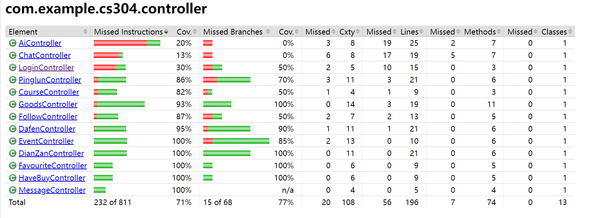
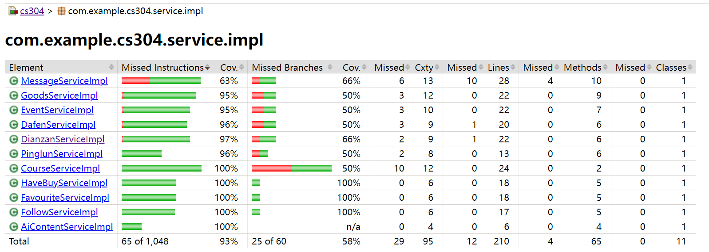
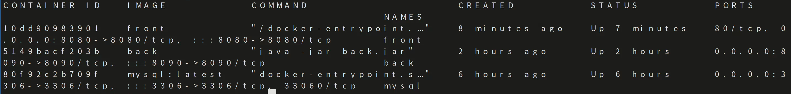

# CS304 final report
## 1.Metric
### Lines of Code
**Total lines of code:**

5212 (backend)

17804 (frontend)

24822 (total)

**Tool used:**
`cloc`
### Number of Packages/Modules
**Total number of packages/modules:**

12 (backend)

7 (frontend)

23 (total)

**Tool used:**
using `(Get-ChildItem -Recurse -Directory .\cs304\src\main\java).Count` and manual count from project structure
### Number of Source Files
**Total number of source files:**

113 (backend)

32 (frontend)

**Tool used:**
using `(Get-ChildItem -Recurse -Include *.java, *.py .\cs304\src).Count` and `(Get-ChildItem -Recurse -Include *.js, *.vue, *.html, *.css .\frontend\cs304\src).Count`

### Number of Dependencies
**Total number of dependencies:**

24 (backend)

17 (frontend)

41 (total)

**Tool used:**
manual count via `package.json` for front-end and `pom.xml` for back-end
## 2. Documentation
### Documentation for End Users

**Location:** [End User Documentation](https://github.com//sustech-cs304/team-project-24spring-22/blob/master/README.md)
### Documentation for Developers

**Location:** [Developer API Documentation](http://120.78.7.40:8090/swagger-ui/index.html)
## 3. Tests
### Automated Testing
**Tools/Frameworks Used:**

JUnit + Spring Test + GitHub Actions
- **JUnit:** For writing and running unit tests.
- **Spring Test:** For integration testing of Spring applications.
- **GitHub Actions:** For continuous integration and automated test execution.

**Source Code/Artifacts:**

[Back-end Tests](https://github.com/sustech-cs304/team-project-24spring-22/tree/master/cs304/src/test/java/com/example/cs304)

**Effectiveness of Tests:**

- **test coverage report:** 
[test result]()

- **Test Coverage:** 83%
- **Explanation:** The test coverage report indicates that 83% of the codebase is covered by tests, ensuring that key functionalities are verified. The detailed breakdown shows:
    - **Instructions Coverage:** 83% of all instructions are tested.
    - **Branch Coverage:** 51% of all branches are tested.
    
    
    The report demonstrates good coverage of the main components of the application, particularly in the entity, common, controller and service.impl packages, which have coverage rates of 82%, 81%, 90% and 93%, respectively. 
### Manual Testing (if applicable)
**Reasons for Manual Testing:** 

1. **Usability Testing:**
   - Manual testing allows for the assessment of the user experience, ensuring that the application is user-friendly and meets the expectations of the target audience.
   - It helps identify issues related to navigation, design, and overall user interaction that automated tests might miss.
2. **Visual and UI Testing:**
   - Manual testing is crucial for checking visual elements, such as layout, colors, fonts, and responsiveness, to ensure they meet design specifications.
   - Automated tools may not accurately capture visual discrepancies or rendering issues across different devices and browsers.

**Manual Testing Steps:** 

1. **Login with Multiple Student Accounts:**
   - First, log in with multiple different student accounts. After successful login, check whether each student's courses are displayed in their respective course schedules.

2. **View and Search All School Courses:**
   - Next, view all the school courses. Enter different search terms to find various courses.

3. **Course Details Interaction:**
   - Then, click to enter the course details to see the detailed course descriptions. Use multiple accounts to like, rate, and comment on the courses. Ensure that one account can see the likes and comments made by other users.

4. **Return to Main Page and Access Schedule:**
   - Return to the main page and enter the schedule section.
   - First, you can see the current week and date.
   - Click the "Compose" button to add new tasks. You can choose different tasks, moods, and urgency levels.
   - Select the week number and day of the week for the task, write the task title and details, and click "Publish".
   - After publishing, you can see the task on the schedule page.
   - Click the "Edit" button to make changes, and click "Details" to view the specifics.
   - If the task is completed, you can mark it as completed by checking the "Complete" button, and then delete it.
   - Click the "Filter" button to view the schedule for a specific week by selecting the week number.
   
5. **Access the Second-Hand Market:**
   - Click to enter the second-hand market page. On the homepage, you can see some listed items.
   - Navigate to the market page, where you can filter and view items by different categories and prices.
   - Click "Post Item" to edit and publish an item, including the name, price, pictures, etc.
   - Click on an item to go to the item details page. Click "Contact Seller" to send a message to the seller.
   - The seller can reply to the messages to negotiate.
   - Click the "Buy" button to purchase an item.
   - Enter your personal profile to see the items you have listed, purchased, and sold. Click the "Logout" button to return to the main page.
   
6. **Access the AI Assistant:**
   - Return to the main interface and go to the AI Assistant section. Enter different chat messages, and ChatGPT will reply based on the input. Click on a fixed prompt (e.g., daily schedule according to course selection) to view the daily schedule generated by GPT.

7. **Logout Successfully:**
   - Finally, log out successfully.

## 4.Build
### Build Process

#### **Tools/Frameworks Used:**

- **GitHub Action**

#### **Tasks Executed in Build:**

We have integrated automated building and deployment, with front-end and back-end building and deployment divided into two parts.

##### FrontEnd Steps

1. Checkout repository
2. Set up Node.js
3. Install dependencies
4. Build
5. Build docker image
6. delete old docker image
7. delete old docker tar
8.  upload new docker image and start-up script
9. load new docker image
10. run project

##### BackEnd Steps

1. Set up the working directory
2. Set up JDK 18
3. packge
4. Build docker image
5. delete old docker image
6. delete old docker tar
7.  upload new docker image and start-up script
8. load new docker image
9. run project

### Final Artifacts

**Description:** 

- FrontEnd: run `npm run build` we will get directory called **dist** which will contains all of the resource that we need to deploy
- BackEnd: We use `mvn package` to build springboot files and we will get executable jar file in the **target** directory called `cs304-0.0.1-SNAPSHOT.jar`

### Buildfile/Script

[Front-end Buildfile](./frontend/cs304/package.json)

[Back-end Buildfile](./cs304/pom.xml)

We use **github action** to do the automatically build and deploy job, the github action script is shown below .

[FrontEnd script](./.github/workflows/vue.yml) 

[BackEnd script](./.github/workflows/deployment.yml)

## 5. Deployment (2 points)

### Containerization

#### Tools/Frameworks Used
- **Docker**
- **Github Action**

#### Script/Artifacts
- **FrontEnd Dockerfile**: 

[	FrontEnd Dockerfile](./frontend/cs304/Dockerfile)

- **BackEnd Dockerfile**: 

​	[BackEnd Dockerfile](./cs304/Dockerfile)

- **FrontEnd Github Action Script**

​	[FrontEnd script](./.github/workflows/vue.yml) 

- **BackEnd Github Action Script**

  [BackEnd script](./.github/workflows/deployment.yml)
  
  

#### Proof of Successful Containerization

- **Snapshot**:
  
