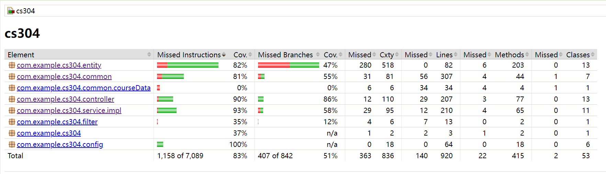
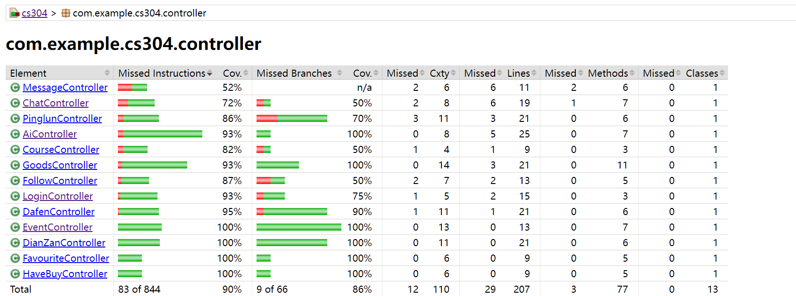

# CS304 final report
## 1.Metric
### Lines of Code
**Total lines of code:**

5212 (backend)

1808779 (frontend)

1814211 (total)

**Tool used:**
`cloc`
### Number of Packages/Modules
**Total number of packages/modules:**

12 (backend)

7 (frontend)

23 (total)

**Tool used:**
using `(Get-ChildItem -Recurse -Directory .\cs304\src\main\java).Count` and manual count from project structure
### Number of Source Files
**Total number of source files:**

113 (backend)

32 (frontend)

**Tool used:**
using `(Get-ChildItem -Recurse -Include *.java, *.py .\cs304\src).Count` and `(Get-ChildItem -Recurse -Include *.js, *.vue, *.html, *.css .\frontend\cs304\src).Count`
### Number of Dependencies
**Total number of dependencies:**

24 (backend)

17 (frontend)

41 (total)

**Tool used:**
manual count via `package.json` for front-end and `pom.xml` for back-end
## 2. Documentation
### Documentation for End Users

**Location:** [End User Documentation](https://github.com//sustech-cs304/team-project-24spring-22/blob/master/README.md)
### Documentation for Developers

**Location:** [Developer API Documentation](http://120.77.79.53:8090/swagger-ui/index.html)
## 3. Tests
### Automated Testing
**Tools/Frameworks Used:**

JUnit + Spring Test + GitHub Actions
- **JUnit:** For writing and running unit tests.
- **Spring Test:** For integration testing of Spring applications.
- **GitHub Actions:** For continuous integration and automated test execution.

**Source Code/Artifacts:**

[Back-end Tests](https://github.com/sustech-cs304/team-project-24spring-22/tree/master/cs304/src/test/java/com/example/cs304)

**Effectiveness of Tests:**

- **test coverage report:** 
[test result]()

- **Test Coverage:** 83%
- **Explanation:** The test coverage report indicates that 83% of the codebase is covered by tests, ensuring that key functionalities are verified. The detailed breakdown shows:
    - **Instructions Coverage:** 83% of all instructions are tested.
    - **Branch Coverage:** 51% of all branches are tested.
  
    The report demonstrates good coverage of the main components of the application, particularly in the entity, common, controller and service.impl packages, which have coverage rates of 82%, 81%, 90% and 93%, respectively. 
### Manual Testing (if applicable)
**Reasons for Manual Testing:** N/A 

**Manual Testing Steps:** N/A

## 4.Build
### Build Process

**Tools/Frameworks Used:**

**Tasks Executed in Build:**

### Final Artifacts

**Description:** The build produces executable files, documentation.

### Buildfile/Script

**Location**:

[Back-end Buildfile (pom.xml)]()

[Front-end Build Script (webpack.config.js)]()

## 5. Deployment (2 points)

### Containerization

#### Tools/Frameworks Used
- **Docker**

#### Script/Artifacts
- **Dockerfile**: [View Dockerfile](https://github.com/your-repo/Dockerfile)

#### Proof of Successful Containerization
- **Snapshot**:
  
